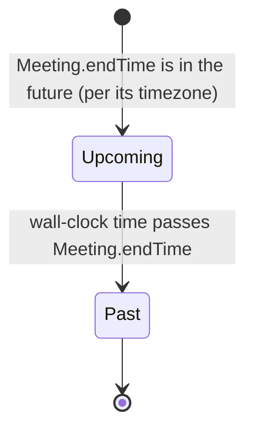
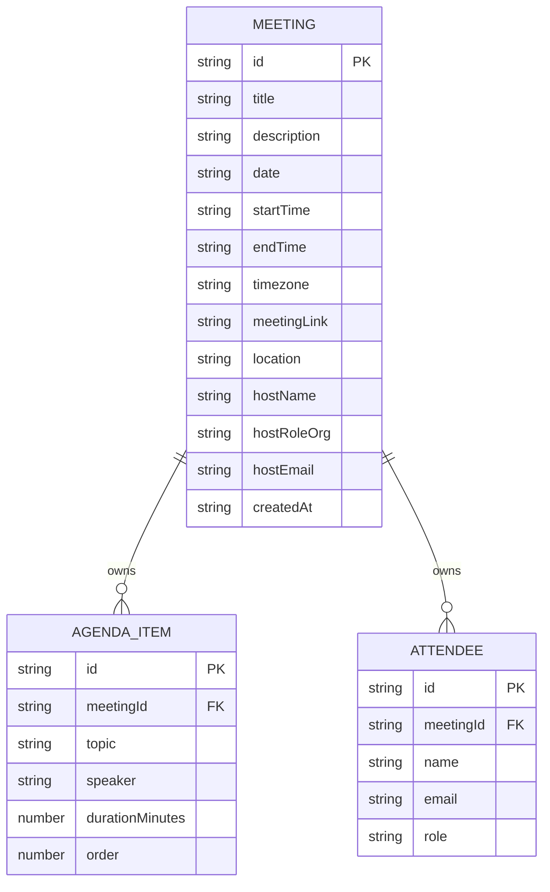

# Functional Specification — Meeting Scheduler & Invitation Card Generator

This is the source of truth for workflows and state transitions. Entity data shape lives in `entities.md`; decision logic lives in `rules.md`. This document ties them together as ordered behavior.

## Workflows

### Workflow 1: Create a Meeting

1. Host clicks "New Meeting" on the Meetings List (Presentation) → navigates to the Create/Edit Meeting screen with a blank form.
2. Host fills in meeting details (title, date, times, timezone, link/location, host info) → Presentation performs field-level inline validation on blur for the two blur-triggered rules, BR1.3 (meeting-link URL format) and BR1.4 (end time after start time); the required-field checks (BR1.1) and the at-least-one-of-link-or-location check (BR1.2) are save-triggered per their `rules.md` `trigger` fields and are evaluated together at save time (step 5), not per-field on blur.
3. Host optionally adds agenda items (topic required per BR2.3, zero allowed per BR2.1, reordering recalculates `order` per BR2.2) and attendees (name required per BR3.4, zero allowed per BR3.1, no duplicate emails per BR3.2, well-formed email per BR3.3), with the live card preview updating within ~1s of each change (NFR1.1) by calling CardGeneration with the current draft state.
4. Host clicks an implicit "Save" (or the flow saves automatically as the host fills fields — Functional Design leaves this UX micro-decision to Code Generation as an implementation detail, since no requirement mandates an explicit save step beyond what's already specified in `refined-mockups/mockups.md`).
5. Scheduling validates the complete Meeting against BR1.1, BR1.2, BR1.3, and BR1.4 (the save-time gate that re-checks every rule regardless of trigger, since a save must not persist an invalid record even if the host never blurred an invalid field), generates a UUID (Q3), sets `createdAt`, and calls PersistenceAdapter to save the Meeting plus its AgendaItems and Attendees.
6. On success: Presentation navigates back to the Meetings List, now showing the new meeting (BR4.1 ordering).
7. On persistence failure (NFR4.1): Scheduling surfaces a non-blocking notice; the form data is retained in Presentation's component state so nothing is lost.

### Workflow 2: Edit an Existing Meeting

1. Host clicks a meeting row on the Meetings List → Presentation loads that Meeting (plus its AgendaItems and Attendees) from Scheduling into the Create/Edit Meeting form, pre-filled.
2. Host edits any field → same validation rules as Workflow 1 apply (BR1.1–BR1.4, BR2.x, BR3.x).
3. On save, Scheduling updates the existing record (same `id`, unchanged `createdAt`) via PersistenceAdapter.

### Workflow 3: Delete a Meeting

1. Host clicks the delete icon on a Meetings List row → Presentation shows the `DeleteConfirmation` component (per `refined-mockups/interaction-spec.md`).
2. Host confirms → Scheduling cascade-deletes the Meeting and all its AgendaItems/Attendees (BR4.2) via PersistenceAdapter.
3. Presentation removes the row from the list; if the list is now empty, it shows the Empty state.

### Workflow 4: Preview and Export the Invitation Card

1. As the host fills in the Create/Edit Meeting form, Presentation passes the current (possibly incomplete) draft to Scheduling's `renderPreview()`, which delegates to CardGeneration for a live preview render (FR5.4) — Presentation never calls CardGeneration directly, per the affirmed layering mandate — debounced to update within ~300ms, well inside the ~1s NFR1.1 budget (refined at nfr-design).
2. The QR payload is resolved per BR5.1: meeting link if present, otherwise an in-app deep link.
3. Host clicks "Export PDF" → Presentation calls Scheduling's `exportCard()`, which passes the validated, saved Meeting data to CardGeneration and renders the full PDF within ~3s (NFR1.2) using the lighter "didn't crash" verification depth affirmed in team practices (no deep PDF-text/QR-payload assertion in tests, per the human's explicit decision).
4. On success: the browser downloads the PDF; a brief "Card downloaded" confirmation shows near the Export button.
5. On failure: CardGeneration's error propagates to Presentation, which shows "PDF export failed — Try again" with a retry action (per the affirmed error-handling practice) — never a silent no-op.

### Workflow 5: Clear My Data

1. Host clicks "Clear my data" (persistent footer action on the Meetings List, per `refined-mockups/mockups.md`) → Presentation shows the `ClearMyDataAction` confirmation.
2. Host confirms → Scheduling instructs PersistenceAdapter to wipe all Meeting/AgendaItem/Attendee records (BR6.1).
3. Presentation returns the Meetings List to its Empty state.

## State Transitions

Meeting has no stored lifecycle field (per Q4/Q4a — Assumptions confirmed no draft/published distinction exists). The only state-like behavior is the **computed, non-persisted** Upcoming/Past display status (BR7.1):

This is a display-only computation re-evaluated on every render; it is never written to storage and has no transition triggered by user action — only the passage of time.

## Entity Relationship Diagram (derived from `entities.md`)

## Rules Summary (derived from `rules.md`)

See `rules.md` for the full source-of-truth YAML block and detailed logic; the table there under "Rules Summary" is the canonical quick-reference.

## Assumptions & Open Questions

None.
