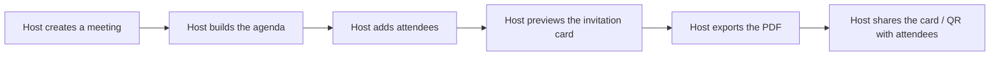

# Scope Document — Meeting Scheduler & Invitation Card Generator

## In Scope

All four capability areas ship together in the first version — none is deferred to a later release [Q1]:

1. **Meeting Scheduling & Details** — title, purpose/description, date, start/end time or duration, timezone selector, meeting link or physical location, host profile (name, role/organization, contact email) [desc][Q2].
2. **Dynamic Agenda Builder** — add, edit, reorder, and remove agenda topics with duration estimates and speaker names [desc][Q2].
3. **Attendee Management** — guest list with name, email, role/designation [desc][Q2].
4. **Invitation Card Engine (PDF export)** — client-side PDF generation, A5/US-Letter card layout, agenda timeline block, host details badge, a QR code, and a live split-screen/modal preview before download [desc][Q2].
5. **Hosting** — the app is deployed as one centrally-reachable instance for the team (not run as separate per-user local installs), reached via an unlisted URL with no login/access-control layer [Q6][Q7][intent-statement:Q9-Q11].

Within each area, the **must-have** baseline is: every form field listed above, full agenda CRUD + reorder, the attendee list, PDF export with a QR code, and the live preview [Q2].

## Out of Scope (this release)

- **Fine-grained visual theming/polish** of the invitation card beyond clean typography and visual hierarchy — nice-to-have, can slip [Q2].
- **`.ics` calendar payload** in the QR code — a URL-only QR (pointing at the meeting link) is sufficient for v1; the `.ics` payload is deferred [Q2].
- **Environment provisioning, observability, incident response, and performance validation** — the hosting need is "just enough to get it reachable" (e.g. a platform like Vercel), not production-infrastructure-grade operations [Q6].
- **Authentication/access control** for the hosted instance beyond an unlisted URL — no login, shared password, or allow-list in this release [Q7].
- **Shared/cloud database or cross-device data sync** — each visitor's meeting data stays local to their own browser session; this was already fixed at Intent Capture and is restated here as an explicit boundary [intent-statement].

## Dependencies & Sequencing

The invitation-card engine depends on scheduling, agenda, and attendee data existing first — those three areas are built before the card engine integrates with them [Q3]. Build order follows a **value-first** heuristic: get a meeting scheduled and a basic card exported working early, then refine visual polish and edge cases afterward [Q4]. There is no hard deadline tied to any specific capability; the only stated timing signal is the general upcoming need for the tool already captured at Intent Capture [Q5].

## Value Stream

Text fallback: Host creates a meeting → builds the agenda → adds attendees → previews the invitation card → exports the PDF → shares the card/QR with attendees. Every step happens within one hosted, centrally-reachable app instance, with each visitor's data kept local to their own browser session [Q1][Q3][intent-statement].

## Scope-to-Stage Adjustment

Resolving the divergence flagged at Intent Capture: the `meeting-card-scheduler` scope currently skips the entire Operation phase. Per the user's decision, only enough is added back to get the app hosted — **deployment-pipeline** and **deployment-execution** — while environment-provisioning, observability-setup, incident-response, performance-validation, and feedback-optimization remain skipped, since there is no real infrastructure or production-scale operational concern here [Q6]. This adjustment is carried forward as a required action at the next stage (Approval & Handoff), which is where the in-scope stage list is actually updated via the workflow's reshape mechanism.

## Assumptions & Open Questions

None.
