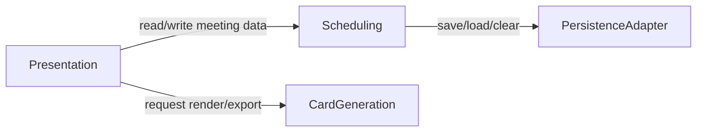

# Component Catalogue — Meeting Scheduler & Invitation Card Generator

## Part A — Machine-Readable Catalogue

```yaml
components:
  - name: Presentation
    summary: React/Next.js UI layer — screens, forms, navigation, and orchestration of the layers below
    behaviour: >
      Renders the Meetings List, Create/Edit Meeting form, agenda/attendee editors, and the live
      card preview. Owns no business rules of its own beyond UI-level concerns (field-level inline
      validation feedback, loading/error/empty state display, navigation between screens). Delegates
      all data mutation and validation to Scheduling, and all card rendering to CardGeneration. Never
      calls PersistenceAdapter or a PDF/QR library directly (affirmed team practice, interview Q6).
    responsibilities:
      - Render the Meetings List, Create/Edit Meeting, and card preview screens
      - Orchestrate the live preview update loop (debounced calls to Scheduling + CardGeneration)
      - Surface loading/error/success/empty states per interaction-spec.md
      - Trigger the "clear my data" flow via Scheduling
    depends_on:
      - component: Scheduling
        interaction: read/write meeting, agenda, and attendee data; validation results
        style: sync
      - component: CardGeneration
        interaction: request a live preview render or a full PDF export, passing already-validated meeting data
        style: sync
    dependents: []
    external_dependencies: []
    entities: []

  - name: Scheduling
    summary: Domain/state layer — owns meeting, agenda, and attendee data and the business rules governing them
    behaviour: >
      Owns the Meeting, AgendaItem, and Attendee entities and all validation invariants: required
      fields (FR1.1), meeting-link URL format (FR1.2), duplicate attendee-email rejection (FR3.3),
      agenda reorder logic (FR2.1), and the "clear my data" operation (FR6.2). Delegates durable
      storage to PersistenceAdapter and never reads/writes browser storage directly.
    responsibilities:
      - CRUD for meetings, agenda items, and attendees
      - Enforce required/optional field rules and URL validation
      - Enforce no-duplicate-attendee-email-per-meeting rule
      - Agenda item reordering
      - Coordinate the "clear my data" operation via PersistenceAdapter
    depends_on:
      - component: PersistenceAdapter
        interaction: save, load, and clear meeting data
        style: sync
    dependents:
      - component: Presentation
        interaction: read/write meeting, agenda, and attendee data; validation results
    external_dependencies: []
    entities:
      - name: Meeting
        identifier: id
        attributes: [title, description, date, startTime, endTime, timezone, link, location, hostName, hostRole, hostEmail, createdAt]
        references: []
      - name: AgendaItem
        identifier: id
        attributes: [meetingId, topic, speaker, durationMinutes, order]
        references:
          - entity: Meeting
            owned_by: Scheduling
            relationship: each AgendaItem belongs to exactly one Meeting
      - name: Attendee
        identifier: id
        attributes: [meetingId, name, email, role]
        references:
          - entity: Meeting
            owned_by: Scheduling
            relationship: each Attendee belongs to exactly one Meeting

  - name: PersistenceAdapter
    summary: Browser-storage adapter (IndexedDB/localStorage) exposing a narrow save/load/clear interface
    behaviour: >
      Wraps the browser's storage API with a minimal save/load/clear/list interface. Owns the
      degradation behaviour required by the affirmed error-handling practice: storage-quota-exceeded,
      corrupted/unparseable stored data, and private-browsing storage restrictions all degrade to an
      in-memory fallback with a non-blocking notice rather than crashing (NFR4.1). Never contains
      business rules — those belong to Scheduling.
    responsibilities:
      - Persist and retrieve Meeting/AgendaItem/Attendee records
      - List all stored meetings (for the Meetings List)
      - Clear all stored data (FR6.2)
      - Degrade gracefully on quota/corruption/availability failures
    depends_on: []
    dependents:
      - component: Scheduling
        interaction: save, load, and clear meeting data
    external_dependencies:
      - name: Browser IndexedDB / localStorage API
        kind: database
        purpose: client-side structured storage; the exact browser API is an implementation choice resolved in Functional Design
    entities: []

  - name: CardGeneration
    summary: Client-side PDF layout + QR code generation engine
    behaviour: >
      Pure-function rendering of already-validated meeting data into a PDF invitation card and a QR
      code. Never reads from Scheduling or the DOM directly (affirmed team practice) — it receives
      plain data as input and returns a rendered card (for live preview) or a downloadable PDF (for
      export). Errors are caught and surfaced to Presentation as actionable, retryable failures
      (per the affirmed error-handling practice), never a silent no-op.
    responsibilities:
      - Render the invitation card layout (A5/US Letter) from meeting/agenda/attendee data
      - Generate the QR code (payload behavior for location-only meetings deferred to Functional Design per FR5.3)
      - Produce a downloadable PDF on export
    depends_on: []
    dependents:
      - component: Presentation
        interaction: request a live preview render or a full PDF export, passing already-validated meeting data
    external_dependencies:
      - name: Client-side PDF rendering library (e.g. @react-pdf/renderer)
        kind: other
        purpose: generates the PDF invitation card entirely in the browser, no server round-trip
      - name: QR code generation library
        kind: other
        purpose: renders the QR code encoding the meeting link (or its fallback, per FR5.3)
    entities: []
```

## Part B — Human-Readable View

### Component Diagram



### Component Summary

| Component | Purpose | Depends On | Dependents | Entities Owned |
|---|---|---|---|---|
| Presentation | UI screens, forms, navigation, state orchestration | Scheduling, CardGeneration | — | — |
| Scheduling | Meeting/agenda/attendee data + business rules | PersistenceAdapter | Presentation | Meeting, AgendaItem, Attendee |
| PersistenceAdapter | Browser-storage save/load/clear | — | Scheduling | — |
| CardGeneration | PDF + QR rendering | — | Presentation | — |

### Entity Ownership

| Entity | Owning Component | Identifier | Attributes | References |
|---|---|---|---|---|
| Meeting | Scheduling | id | title, description, date, startTime, endTime, timezone, link, location, hostName, hostRole, hostEmail, createdAt | — |
| AgendaItem | Scheduling | id | meetingId, topic, speaker, durationMinutes, order | Meeting (Scheduling) |
| Attendee | Scheduling | id | meetingId, name, email, role | Meeting (Scheduling) |

### External Dependencies

| Component | Dependency | Kind | Purpose |
|---|---|---|---|
| PersistenceAdapter | Browser IndexedDB / localStorage API | database | Client-side structured storage |
| CardGeneration | Client-side PDF rendering library | other | Generates the PDF invitation card in-browser |
| CardGeneration | QR code generation library | other | Renders the QR code on the card |

### Rationale

| Component | Why a separate building block |
|---|---|
| Presentation | Distinct concern (UI/UX) and distinct change rate — visual/interaction changes should never require touching business rules or storage logic |
| Scheduling | Distinct data ownership (owns all three entities) and distinct concern (business rules) — the affirmed layering mandate treats this as the one authority for domain invariants |
| PersistenceAdapter | Distinct lifecycle and distinct concern (storage mechanics vs. business rules); kept separate per Q2 for independent testability and to keep the door open for a future swap to local SQLite, as the original description names as an alternative storage option |
| CardGeneration | Distinct concern (rendering vs. domain logic) and distinct change rate — visual card design changes independently of scheduling business rules; kept dependency-free of Scheduling (Q4) so it stays independently testable and reusable for both the live preview and the actual export |

No component-boundary trade-off required a documented Option A/B comparison at the gate — the four-way split follows directly from the already-affirmed team practice's layering mandate (Q1), so this decomposition had only one viable shape.

## Assumptions & Open Questions

None.
